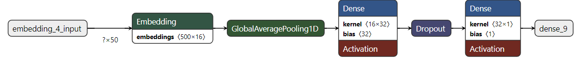
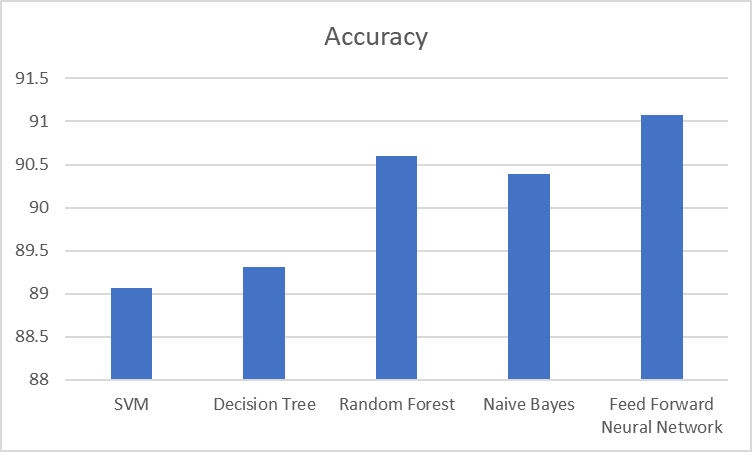

# Advanced Email Spam Detection Using TensorFlow

## Project Overview
This project represents a significant advancement in email spam detection, leveraging state-of-the-art machine learning techniques. Our approach uses a TensorFlow-based feedforward neural network to classify emails into spam and non-spam (ham) categories with high accuracy. The model addresses the limitations of traditional rule-based and simple machine learning techniques, which struggle with the complexity and diversity of modern spam. The detailed architecture and training process are designed to optimize the detection accuracy while maintaining efficient computational performance.

## Contributors
- **Venkatesh V Ankola** - venkateshva.btech22@rvu.edu.in 
- **Sushan Rai** - sushanrai.btech22@rvu.edu.in  
- **Vasanth J** - vasanthj.btech22@rvu.edu.in 
- **Kalp Jain** - kalpj.btech22@rvu.edu.in 

## Dataset Description
The training dataset comprises a meticulously curated collection from the Enron Email Dataset and SpamAssassin Public Corpus, enriched with additional sources to reflect a broad spectrum of spam tactics. The dataset is balanced to prevent biases in model training, with equal proportions of spam and ham messages that include variations in language, tone, and style, representing the real-world complexity of email communication.

## Model Architecture
The neural network consists of several layers designed to process and classify text data effectively:
- **Embedding Layer**: Maps words to a high-dimensional vector space, translating text into a format suitable for neural processing.
- **Global Average Pooling Layer**: Simplifies the output of the embedding layer by averaging over the sequence dimension, reducing the number of parameters and computational cost.
- **Dense Layers**: A series of layers that learn to detect complex patterns and relationships in the data.
- **Dropout Layers**: Included to reduce overfitting by randomly omitting units during training.
- **Output Layer**: A single neuron that uses a sigmoid activation function to classify an email as spam or not.



## Installation
To set up this project, follow these steps:
```bash
git clone https://github.com/your-repository/spam-detection-tensorflow
cd spam-detection-tensorflow
pip install -r requirements.txt

```
## Usage

To run the spam detection model and classify new emails:

```
stramlit run app.py
```


## Model Training and Evaluation
The model was trained over 30 epochs with early stopping implemented to prevent overtraining. Evaluation metrics such as accuracy, precision, recall, and F1-score were computed on a separate test set to assess performance. Our model demonstrated excellent capability in distinguishing spam from legitimate emails, achieving a final accuracy of about 91.36%.



## Future Work and Extensions
The future roadmap includes:

- Integrating the model into a Chrome extension for real-time email scanning.
- Exploring advanced neural network architectures like LSTM and Convolutional Neural Networks for enhanced performance.
- Creating a more diverse and extensive dataset to further improve model robustness.
Contributing
- We welcome contributions from the community. Please refer to CONTRIBUTING.md for more details on how to submit pull requests and suggest improvements.


## Acknowledgements
Special thanks to the Department of Computer Science and Engineering at RV University for providing the resources and environment necessary to conduct this research.

